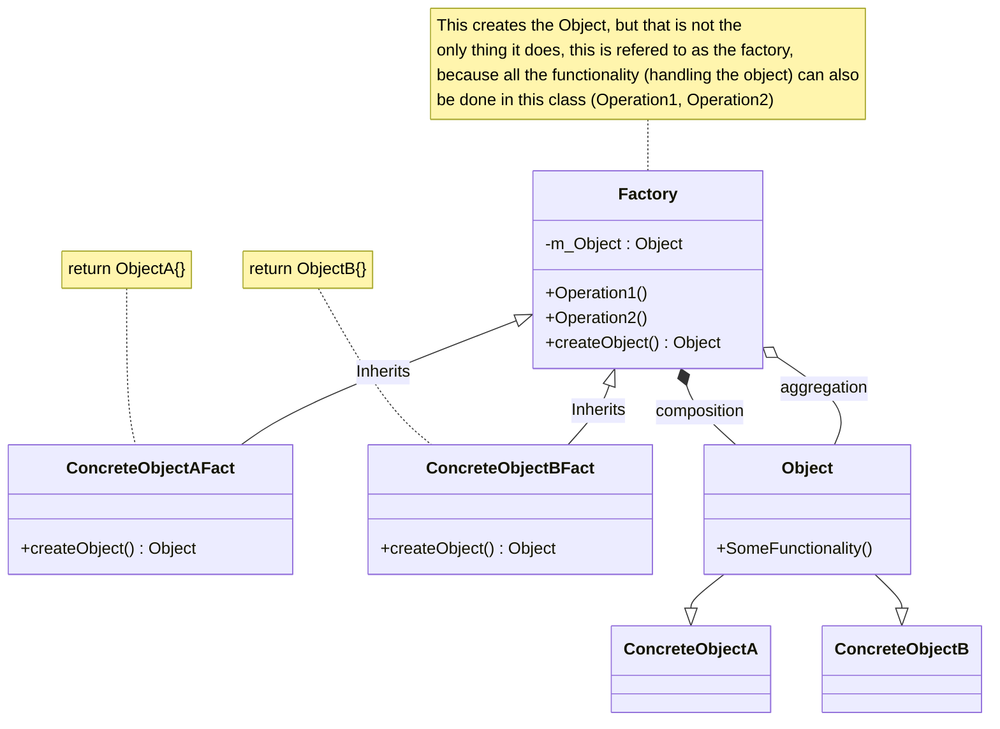

### 1) Interface
  - Create a Interface (pure virtual)
  - Concrete subclasses will be created from this interface

### 2) Creator
  - Create a `Creator` base class -> creates the Interface
  - Subclass the `Creator` class with concrete `Creator Classes`
  - Creates a object || returns a existing object

### 3) UML Representation

